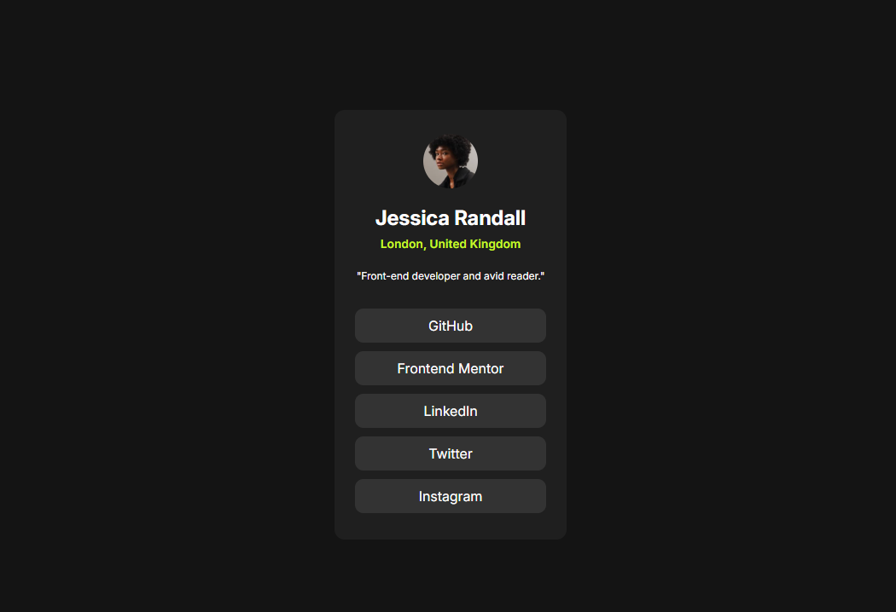

# Frontend Mentor - Social links profile solution

This is a solution to the [Social links profile challenge on Frontend Mentor](https://www.frontendmentor.io/challenges/social-links-profile-UG32l9m6dQ). Frontend Mentor challenges help you improve your coding skills by building realistic projects.

## Table of contents

- [Frontend Mentor - Social links profile solution](#frontend-mentor---social-links-profile-solution)
  - [Table of contents](#table-of-contents)
  - [Overview](#overview)
    - [The challenge](#the-challenge)
    - [Screenshot](#screenshot)
    - [Links](#links)
  - [My process](#my-process)
    - [Built with](#built-with)
    - [What I learned](#what-i-learned)
    - [Continued development](#continued-development)
  - [Author](#author)

## Overview

### The challenge

Users should be able to:

- See hover and focus states for all interactive elements on the page

### Screenshot



### Links

- Solution URL: [Solution](https://github.com/OmarRafat975/Social-links-profile.git)
- Live Site URL: [Live Site](https://omarrafat975.github.io/Social-links-profile/)

## My process

### Built with

- Semantic HTML5 markup
- CSS custom properties
- Flexbox

### What I learned

I learned how to deal with links and how to use it.

```html
<menu class="buttons">
  <ul aria-label="Links to All The social profiles">
    <li>
      <a href="https://www.github.com/" target="_blank">GitHub</a>
    </li>
    <li>
      <a href="https://www.frontendmentor.io/" target="_blank"
        >Frontend Mentor</a
      >
    </li>
    <li>
      <a href="https://www.linkedin.com/" target="_blank">LinkedIn</a>
    </li>
    <li>
      <a href="https://www.twitter.com/" target="_blank">Twitter</a>
    </li>
    <li>
      <a href="https://www.instagram.com/" target="_blank">Instagram</a>
    </li>
  </ul>
</menu>
```

```css
.buttons li {
  list-style: none;
  background-color: hsl(0, 0%, 20%);
  margin: 10px 0;
  /*padding: 0 20px; */
  width: 14rem;
  height: 2.5rem;
  border-radius: 10px;
}
.buttons li :hover {
  color: hsl(75, 94%, 57%);
}

.buttons li a {
  position: relative;
  text-decoration: none;
  color: hsl(0, 0%, 100%);
  text-align: center;
  top: 25%;
}
```

### Continued development

I Want To focas more in CSS because I found it hard to play with ;)

## Author

- Website - [Omar Rafat](https://github.com/OmarRafat975)
- Frontend Mentor - [@OmarRafat975](https://www.frontendmentor.io/profile/OmarRafat975)
